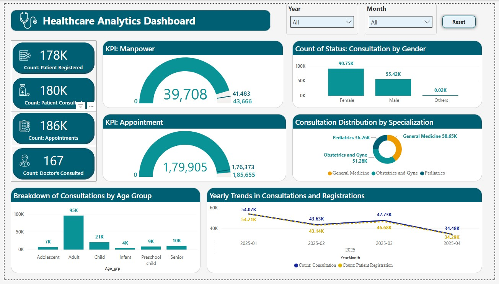
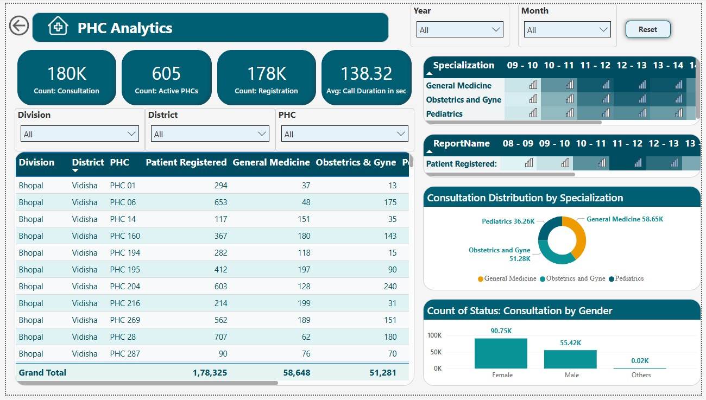
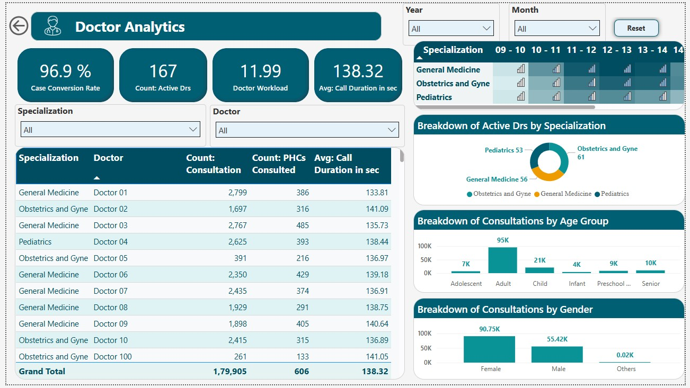

# 🏥 Healthcare Analytics Dashboard (Power BI)

## 🔍 Project Overview

This Healthcare Analytics Dashboard is a powerful, interactive Power BI solution designed to monitor and evaluate Primary Health Center (PHC) performance, doctor efficiency, patient behavior, and overall healthcare KPIs.

> 🎯 **Target Audience:** Healthcare administrators, data-driven decision makers, and recruiters evaluating data visualization and analytics capability.

---

## 💡 Key Features

- 📊 **Three Main Dashboards:**
  - **PHC Analytics:** Track registrations, consultations, and specialization trends across multiple health centers.
  - **Doctor Analytics:** Evaluate doctor performance, workloads, and consultation quality.
  - **Healthcare Overview:** Macro-level summary with trends, gender breakdown, manpower & appointments.

- 📈 **Visuals & Metrics:**
  - Total Consultations, Registrations, Appointments
  - Gender-wise and Age-group-wise consultation analysis
  - Doctor workload, specialization ratio, and case conversion rate
  - Yearly trends in healthcare engagement

- 📍 **Filters & Drilldowns:** Year, Month, Specialization, District, PHC, Doctor

---

## 🧠 Technologies Used

- **Power BI (Desktop)**
- DAX (Data Analysis Expressions)
- Power Query (ETL)
- Custom visuals & slicers

---

## 📌 Project Impact

- Identifies underperforming PHCs and overburdened doctors
- Highlights gender disparities in healthcare access
- Enables strategic manpower planning and policy interventions

---

## 📂 File Structure

- `healthcare-analytics-dashboard.pbix` – Main Power BI report file
- `/screenshots` – Image previews of dashboards
- `README.md` – Project documentation

---

## 🧪 Sample KPIs

| Metric                   | Value      |
|--------------------------|------------|
| Total Consultations      | 180K       |
| Patient Registrations    | 178K       |
| Case Conversion Rate     | 96.9%      |
| Avg. Call Duration       | 138.32 sec |
| Female Consultation Rate | 90.75K     |

---

## 👨‍💼 About Me

I'm a data professional passionate about using Power BI to transform raw data into actionable insights. This project showcases my skills in **data storytelling, DAX modeling, and user-centric design**.

🔗 [LinkedIn](https://www.linkedin.com/in/ashutoshsinghindore)  
📧 ashutoshsinghindore@gmail.com

---

## ⭐ Key Features

- ✅ Clean, interactive layout
- ✅ Business-relevant KPIs
- ✅ Real-world healthcare domain use case
- ✅ Optimized for both summary-level and deep-dive analytics

---

## 📸 Dashboard Previews
### Overview  

### PHC Analytics  
  
### Doctor Analytics  
 

---

## 🧩 What's Next?

- 🔍 Predictive consultation trends
- 📌 PHC performance benchmarking
- 📦 Integration with real-time API for live dashboards

---

> “Without data, you’re just another person with an opinion.” – W. Edwards Deming
