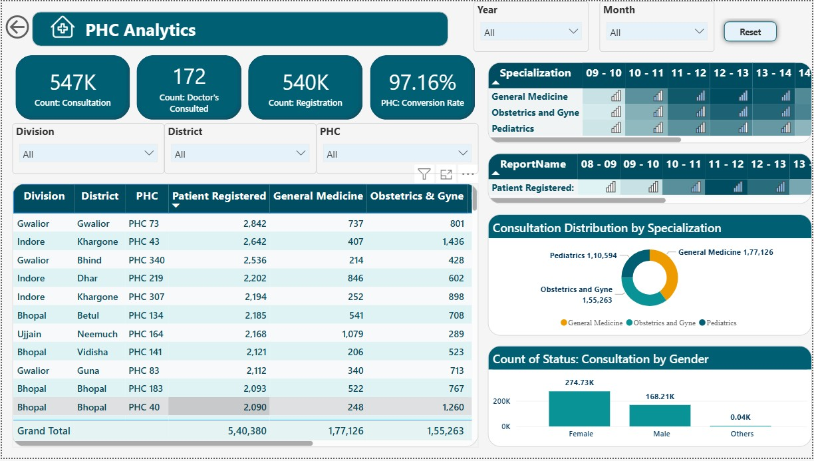

# 🩺 PHC Healthcare Performance Dashboard – Power BI & Python ETL

This end-to-end project analyzes healthcare activity across Primary Health Centers (PHCs) using **Power BI** and a custom-built **Python ETL pipeline**. It showcases how to transform raw public health data into meaningful insights for decision-makers in government or public health administration.

> 📌 **Project Type**: Dashboard + ETL Pipeline  
> 🚀 **Tools**: Power BI, Python (pandas, numpy), Parquet  
> 📊 **Domain**: Healthcare Analytics / PHC Performance  

---

## 📌 Overview

This project tracks and analyzes:
- Patient registrations
- Doctor consultations
- Appointment behavior
- PHC login/uptime patterns

It is intended to help **district health officers, program managers, or state health departments** monitor PHC-level activity and optimize manpower and service delivery.

---

## 🧠 Features

### ✅ Dashboard Insights
- 📍 Top 10 Performing PHCs by consultation volume
- 🧑‍⚕️ Doctor-wise consultations with specialization filters
- 🕒 Time-based breakdown (by day, month, hour)
- 📊 Gender- and age-group-wise registration analytics
- 🧭 District/division-level healthcare summary
- 🔍 Drill-throughs for PHC or doctor details

### 🧹 Python ETL Pipeline
- Modular scripts to clean each fact table:
  - `Appointments`, `Consultations`, `Patient Registrations`, `PHC Logins`
- Foreign key mapping for `Doctor`, `PHC`, and `Date` dimensions
- Generates `.parquet` output for fast Power BI import
- All preprocessing logic located in `/preprocessing/`

---

## 🗂️ Folder Structure
## 🧪 ETL Pipeline

The core logic is defined in `preprocess_main.py`.

### 🔁 Steps:
1. Load raw Excel/CSV data from `01_DataSources/RAW`
2. Clean each dataset via its own preprocessor module
3. Generate:
   - `Dim_Date`
   - `Dim_Doctor`
   - `Dim_PHC`
4. Replace text with foreign keys (for star schema modeling)
5. Save cleaned tables as `.parquet` in `Processed/`

### ▶️ Run Locally
run Run Preprocessor.bat

📸 Dashboard Screenshots
📊 Overview

🧑‍⚕️ Doctor Analytics

🏥 PHC Analytics

🔍 Key Measures (DAX)
Measure Name	Description
Total Registrations	Count of patients registered
Total Consultations	Valid consultations (duration > 2 min)
Doctor Count Active	Distinct doctors providing service
Consultations by Specialization	Count grouped by doctor specialty
PHC Rank by Consultation	Ranking logic for high-performing PHCs

📈 Visuals Used
Clustered column charts

Table and multi-row cards

Matrix with row headers

Custom tooltip pages

Drill-through on doctor and PHC

💼 Use Cases
Monthly PHC performance reviews

Manpower planning at block/district level

Identifying under-utilized or overburdened PHCs

Program impact tracking across divisions

📃 License
MIT License — feel free to use, extend, and improve.

🙋 About the Author
Ashutosh Singh
Data Analyst | Power BI Consultant | Data Enthusiast

📫 ashutoshsinghindore@gmail.com • www.linkedin.com/in/ashutoshsinghindore