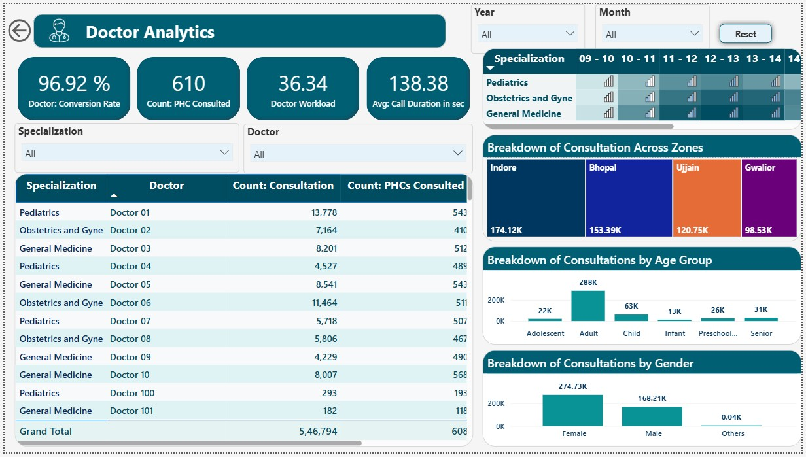

# 🏥 Healthcare Analytics Dashboard (Power BI)

 

 

## 🔍 Project Overview

This Healthcare Analytics Dashboard is a powerful, interactive Power BI solution designed to monitor and evaluate Primary Health Center (PHC) performance, doctor efficiency, patient behavior, and overall healthcare KPIs.

> 🎯 **Target Audience:** Healthcare administrators, data-driven decision makers, and recruiters evaluating data visualization and analytics capability.

---

## 📸 Dashboard Previews
|  Page | Screenshot |
|----------|--------------|
| Overview | |
| PHC Insights |   |
| Doctor Insights |   |

---

## 💡 Key Features

- 📊 **Three Main Dashboards:**
  - **PHC Analytics:** Track registrations, consultations, and specialization trends across multiple health centers.
  - **Doctor Analytics:** Evaluate doctor performance, workloads, and consultation quality.
  - **Healthcare Overview:** Macro-level summary with trends, gender breakdown, manpower & appointments.

- 📈 **Visuals & Metrics:**
  - Total Consultations, Registrations, Appointments
  - Gender-wise and Age-group-wise consultation analysis
  - Doctor workload, specialization ratio, and case conversion rate
  - Yearly trends in healthcare engagement

- 📍 **Filters & Drilldowns:** Year, Month, Specialization, District, PHC, Doctor

---

## 🧠 Technologies Used

### 🧠 Data Preprocessing & ETL
- **Python + Pandas**: Initial data shaping, type casting, date parsing, and KPI derivation
- **Power Query (M Language)**: Data ingestion, table joins, column transformation, and conditional logic
- **Excel / CSV**: Base data input from operational systems

### 📐 Data Modeling
- **Power BI Data Model**:
  - Star schema with Fact and Dimension tables
  - Relationships using keys: Doctor ID, PHC ID, Date, Specialization
- **DAX (Data Analysis Expressions)**:
  - Measures for Consultation %, Conversion Rate, Doctor Load, etc.

### 📊 Visualization & UX
- **Power BI Desktop**:
  - Donut & Pie Charts, Line Graphs, Card KPIs, Stacked Bars
  - Custom slicers: Date, Gender, Specialization, PHC, Doctor
  - Conditional formatting, tooltip insights, drill-through filters

---

## 🔄 Data Pipeline Overview

### 1. 🧼 Data Cleaning (Python + Power Query)
- Standardized gender values (F/M/O → Female/Male/Others)
- Converted `CallDuration` strings to numeric seconds
- Filled nulls with defaults or removed invalid records
- Merged tables: Registrations, Appointments, Consultations

### 2. 🧮 Transformations
- Derived fields:
  - `AgeGroup`: Infant, Child, Teen, Adult, Senior
  - `Appointment Status`: No-Show, Completed
  - `Consultation Duration`, `Doctor Load`
- Extracted `Year`, `Month`, `Week` from dates

### 3. 🔗 Modeling
- Linked:
  - Doctors ↔ Consultations
  - PHCs ↔ Appointments
  - Dates ↔ All Fact Tables
- Used **star schema** for query performance

### 4. 📐 DAX Metrics
- `Total Consultations`, `Appointments`, `Registrations`
- `Conversion Rate` = Consultations ÷ Appointments
- `Doctor Workload Score` via `RANKX`
- `Gender-wise Consultations`, `Specialization Trends`

---

## 🎯 KPIs Tracked

| Category          | Key Metrics                                 |
|-------------------|---------------------------------------------|
| **Appointments**  | Total Appointments, Conversion %, No-Shows  |
| **Consultations** | Count, Avg Duration, Specialization Trends  |
| **PHCs**          | Patient Load, Registration vs Consultation  |
| **Doctors**       | Consultations, PHC Count, Case Conversion   |
| **Demographics**  | Gender Split, Age Group Analysis            |

---

## 📌 Project Impact

- Identifies underperforming PHCs and overburdened doctors
- Highlights gender disparities in healthcare access
- Enables strategic manpower planning and policy interventions

---

## 📂 File Structure

- `healthcare-analytics-dashboard.pbix` – Main Power BI report file
- `/screenshots` – Image previews of dashboards
- `README.md` – Project documentation

---

## 🧪 Sample KPIs

| Metric                   | Value      |
|--------------------------|------------|
| Total Consultations      | 180K       |
| Patient Registrations    | 178K       |
| Case Conversion Rate     | 96.9%      |
| Avg. Call Duration       | 138.32 sec |
| Female Consultation Rate | 90.75K     |

---

## 👨‍💼 About Me

I'm a data professional passionate about using Power BI to transform raw data into actionable insights. This project showcases my skills in **data storytelling, DAX modeling, and user-centric design**.

🔗 [LinkedIn](https://www.linkedin.com/in/ashutoshsinghindore)  
📧 ashutoshsinghindore@gmail.com

---

## ⭐ Key Features

- ✅ Clean, interactive layout
- ✅ Business-relevant KPIs
- ✅ Real-world healthcare domain use case
- ✅ Optimized for both summary-level and deep-dive analytics

---

## 🧩 What's Next?

- 🔍 Predictive consultation trends
- 📌 PHC performance benchmarking
- 📦 Integration with real-time API for live dashboards

---

> “Without data, you’re just another person with an opinion.” – W. Edwards Deming
